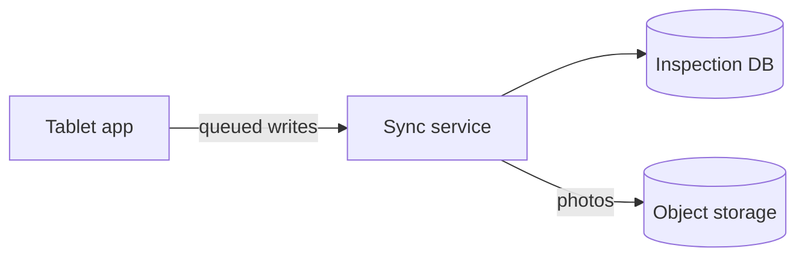

# Section catalogue

What each section is for, when it earns its place, how it fails, and what good
looks like. Use this as raw material, not as a form to fill in — see
`choosing-sections.md` for how to select.

> Adapted from Michael Lynch's "How to Write an Effective Software Design
> Document"
> (<https://refactoringenglish.com/excerpts/write-an-effective-design-doc/>),
> restated in our own words. Examples here are ours.

Headings in the output are written in the user's language. The English names
below are identifiers for you, not literal headings.

---

## Title

Short, distinctive, pronounceable, and suggestive of what the thing does. This is
the word people will use in conversation for the next several years, so a name
that describes the function beats a name that sounds impressive.

## Metadata

Author and contact, creation date, canonical location, status. Add approvers and
their sign-off dates only when the document actually requires sign-off. For solo
or small-team work, three lines is the right size.

## Objective

One sentence, plain language, on the first page.

> **Objective**: Let field staff record inspection results offline on the
> tablets they already carry, and reconcile those records once they are back in
> network coverage.

**Fails when** it reaches for detail. If it needs a second sentence, the second
sentence belongs in Background.

## Background

Why this, why now, and what came before. Answer: what problem exists, what
prompted the work, and whether anyone has attempted it before and how that went.

Anchor the problem in observed facts rather than impressions — a measured number
makes the case in a way that "users say it feels slow" cannot.

**Fails when** it assumes the reader attended the meeting where the project was
conceived. Many readers will not have.

## Related documents

Links to the test plan, functional specs, design documents for neighbouring
systems, and earlier iterations of this design. Cheap to write, and the reader
who needs it is otherwise stuck.

## Goals

What the world looks like once this is done, stated as outcomes for users, the
team, or the business.

> - Inspections can be completed with no network connection.
> - An inspector never loses entered data, even if the tablet restarts.

**Fails when** stated as implementation ("adopt an offline-first database"). That
is a means, and naming it as a goal quietly forecloses the design.

## Non-goals

What a reader might reasonably assume is in scope but is not, each with a short
reason. This is where scope creep gets killed cheaply.

> - **Real-time collaboration between inspectors.** Two inspectors editing the
>   same record simultaneously is rare enough in the field that conflict
>   resolution beyond last-writer-wins is out of scope for v1.

## Scenarios

Concrete walkthroughs of the finished system in use. Numbered steps with a named
actor. One or two are usually enough; they exist so the reader can picture the
result, not to enumerate every path.

> **Scenario: inspection in a basement with no signal**
> 1. Aoki opens the app before leaving the office; the day's assignments sync.
> 2. In the basement, Aoki completes three inspections and attaches photos.
> 3. The app shows each record as "not yet synced".
> 4. Back in the van, coverage returns and the three records upload; Aoki sees
>    all three marked as synced.

## Diagrams

Use Mermaid, inline in the document, so the diagram stays editable. An image or a
whiteboard photo becomes frozen the moment it is pasted in, and then it silently
diverges from reality.

Draw what prose conveys badly: how data moves, how components relate, how the
system talks to its dependencies, what the sequence of a protocol exchange is.

## Glossary

Internal tool names, domain terms, and abbreviations a new reader would not know.
Prefer defining terms inline at first use; a glossary is the fallback for terms
that recur throughout. Best of all is choosing terms that need no definition.

## Constraints

Limits imposed from outside the design — budget, hardware, contracts, an existing
system that cannot be changed, a regulator's requirement. Stating them keeps
reviewers from proposing options that were never available.

## Service level objectives

Measurable targets: availability, latency, throughput, capacity. Numbers, not
adjectives.

> - Sync of one inspection record completes within 5 seconds at the 95th
>   percentile on a 4G connection.
> - The API is available 99.5% of each calendar month.

Include this section when the system runs unattended and someone would notice it
degrading. Skip it for tools invoked by hand.

## Monitoring and alerting

How the objectives above are observed, and what wakes someone up. Answer: if this
stops working, how do you find out, and how long does that take? If a section of
SLOs has no corresponding monitoring, the objectives are decorative.

## Logging

What events are recorded, at what levels, where they are stored, how long they
are kept, who can read them, and what must never appear in them (credentials,
personal data, payment details). Decided at design time this is cheap; retrofitted
after an incident it is not.

## Staged verification plan

The order of construction, chosen so that mistakes surface as early as possible.

This is **not** a task breakdown and **not** a schedule. Each stage states what
becomes verifiable when it lands, and by whom.

> - **Stage 1**: The inspection form works end to end against fixed sample data,
>   with no server. Field staff can confirm the form matches how they actually
>   work, before any sync is built.
> - **Stage 2**: Records persist locally across restarts. Data loss can be
>   tested by force-quitting the app.
> - **Stage 3**: Sync against the staging server, including conflict handling.

Include this section when the order of construction is itself a design decision —
which it usually is when requirements carry real uncertainty. If the order is
obvious, omit it.

## Interfaces

The surfaces through which people or other software reach this system: API
shapes, CLI semantics, file formats, and rough UI sketches. Show signatures and
types; resist writing the implementation behind them.

For UI, a rough sketch or a list of elements is enough. Precise visual decisions
are cheap to reverse and do not belong here.

## Dependencies and infrastructure

Language, runtime, third-party libraries and services, where the code runs, where
data lives. For each, note whether it would be painful to change later — that is
what determines how much justification it deserves here.

> - **Language**: C#/.NET — the team's primary stack; changing it later is
>   effectively a rewrite, so it is recorded here with alternatives.
> - **Email delivery**: not decided. Any provider can be swapped in an
>   afternoon, so this is deliberately left open.

Writing "not decided, and here is why that is safe" is a legitimate and useful
outcome.

## Security

What threats were considered, where the attack surface is, and where trust
boundaries sit — the points where data crosses from a less trusted context into a
more trusted one. Include the reasoning even when the conclusion is that the risk
is low; the stated reasoning is what lets a reviewer catch what you missed.

## Privacy

What sensitive data the system handles, how long it is kept, who can reach it,
and how it is protected in transit and at rest. Required whenever personal,
medical, financial, or employment data is involved.

## Legal considerations

Regulatory obligations, contractual limits, licensing. Include when the domain is
regulated, when a client contract constrains what may be stored or where, or when
publishing under an open-source licence.

## Open issues

Every question still unresolved, each with: what the problem is, what options
exist, and the concrete next step toward closing it. A next step is a specific
action with an owner, not "investigate further".

> **Open issue: photo retention period**
> Inspection photos are the bulk of storage cost. Legal has not confirmed the
> statutory retention period — it may be 3 or 7 years, and the difference is
> roughly a 2× storage bill.
> **Options**: keep everything for 7 years; keep 3 years then downsample.
> **Next step**: ask the client's compliance contact at the review on the 20th.

This section is mandatory. If nothing is open, say so explicitly.

## Resolved issues

Once an open issue is settled, move it here with the decision stated at the top
and the original discussion retained beneath it. The discussion is the valuable
part when someone revisits the decision two years later.

## Alternatives considered

The options a reader would ask "why not X?" about, each with a few lines on why
it lost. Keep it brief — this is a section for the two or three serious
contenders, not a catalogue of every idea that was ever raised.

## Out of scope for this document

The sections deliberately excluded, one line of reasoning each. Always present.
